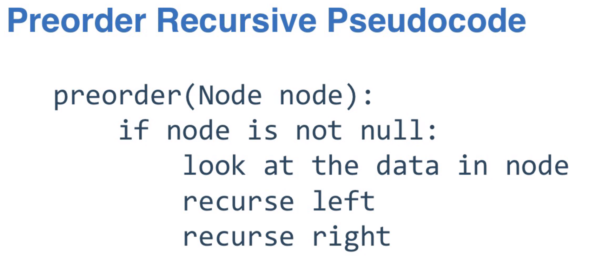

# Abstract Data Types (ADTs)

- Estrutura de dados que é um container com número finito de objetos
- Existe uma relação entre os objetos
- São omitidos os detalhes de implementação de cada tipo
- Exitem métodos padrões para manipulação dos dados armazenados

# Linear ADTs

- Dados finitos
- Cada objeto tem 1 antecessor imediato
- Cada objeto tem 1 sucessor imediato

## [ArrayList](src/main/java/adt/linear/arraylist/ArrayListImplementation.java)

- Buscar por id, inserir, deletar - O(1) *
- Busca/Pesquisa - 0(n)
- IsEmpty(), clear(), size()

* inserir em ArrayList no caso o array cheio, é O(n), mas esse valor é amortizado

## [Linked List](https://github.com/hader-araujo/algorithms/tree/main/src/main/java/linkedlist)

- Contém variável head que é um Node (valor e referência para o próximo Node)
- não contém busca/pesquisa

### [Singly linked list (SLL)](src/main/java/adt/linear/linkedlist/singlylinkedlist/SinglyLinkedList.java)

- addToFront e removeFromFront - O(1)
- addToBack e removeFromBack - O(n)

### [SLL com variável size](src/main/java/adt/linear/linkedlist/singlylinkedlist/SinglyLinkedListOptimizationWithSize.java)

- Contém variável size e é utilizada nos 'edge cases' para verificar se a lista está vazia
- addToFront e removeFromFront - O(1)
- addToBack e removeFromBack - O(n)

### [SLL com variável tail](src/main/java/adt/linear/linkedlist/singlylinkedlist/SinglyLinkedListOptimizationWithTail.java)

- Contém variável tail que é um Node com referencia para o último node da lista
- addToFront e removeFromFront - O(1)
- **addToBack - O(1)**
- removeFromBack - O(n)
- adiciona novos edge cases nos métodos addToFront e removeFromFront quando size é 0 ou 1

### [SLL com Iterable](src/main/java/adt/linear/linkedlist/singlylinkedlist/SinglyLinkedListOptimizationWithTailIterable.java)

- implements Iterable
- método iterator() retorna uma instância de uma subclasse de Iterator
- Subclasse de Iterator contém método hasNest() e next()

#### [Recursion in LinkedLists]((src/main/java/adt/linear/linkedlist/singlylinkedlist/SinglyLinkedListOptimizationWithSizeWithMethodRemoveAllDuplicates.java))

- Com acesso interno a SLL, objetos ordernados, remover todos os objetos duplicados.
- Isso feito em O(n)

### [Double linked list (DLL)](src/main/java/adt/linear/linkedlist/doublylinkedlist/DoublyLinkedList.java)

- Contém variável head e tail que é um Node (valor e referência para o próximo Node e **node anterior**)
- Usa mais memória, mas é muito mais eficiente do que SLL
- addToFront, removeFromFront, addToBack e removeFromBack - O(1) - usando next e previus referências
- adiciona novos edge cases nos métodos ao remover com size igual 1

### [Circular linked list (CLL)](src/main/java/adt/linear/linkedlist/circularlylinkedlist/CircularlyLinkedList.java)

- Método next do último node aponta para head
- Não precisa da variável tail
- addToFront: 0(1): create new Node com valor de head na posição 1 -> insere o novo valor em head (posição 0)
- addToBack: 0(1): create new Node com valor de head na posição 1 -> insere o novo valor em head (posição 0) -> head
  passa a
  ser posição 1 (head = head.next)
- removeFromFront: 0(1): valor de head recebe valor da posição 1 -> node da posição 1 passa a ser da posição 2 (
  head.next =
  head.next.next) - aumenta um edge case para size == 1
- removeFromBack: 0(n): precisa percorrer toda a lista para obter um node antes do último e ele passar a apontar para
  head

## [Stack](https://github.com/hader-araujo/algorithms/tree/main/src/main/java/stack)

- LIFO (Last In, First Out)
- Não tem pesquisa
- Não acessa elementos a não ser o último adicionado
- Operações suportadas:
    - void push(x): adiciona elemento no final
    - x pop(): remove último elemento adicionado
    - x peek() / x top(): retorna último elemento adicionado sem remover
    - boolean isEmpty(): retorna se está vazio
    - void clear(): limpa a pilha removendo todos os elementos
- Operações NÃO suportadas:
    - searching for data
    - Arbitrary index access
    - Arbitrary add or remove

Stack é definido pelas suas operações e não pela sua estrutura de armazenamento dos dados.

## [Stack baseado em Singly Linked List](https://github.com/hader-araujo/algorithms/tree/main/src/main/java/stack/SinglyLinkedListBackedStack.java)

- Não precisa de variável tail
- Não é utilizado/necessário Double Linked List (Double Linked List tem mais consumo de mémoria)
- São leves e simples
- Singly Linked List é a melhor opção para Stack
- push, pop, peek, isEmpty: O(1)

## [Stack baseado em Array](https://github.com/hader-araujo/algorithms/tree/main/src/main/java/stack/ArrayBackedStack.java)

- Baseado em SLL é checado head, Baseado e Array é checado a variável size
- Operações são sempre no final do array: O(1)*
- clear(), 3 opções:
    - Apenas deixa os dados no array e seta o size para 0: O(1) mas garbage collect não tem opção de coletar os dados
    - Seta cada indice para null: O(n)
    - Seta o array para uma nova instância assim o garbage collect pode coletar os dados: O(1)

## [Queue](https://github.com/hader-araujo/algorithms/tree/main/src/main/java/queue)

- FIFO (First In, First Out)
- Operações suportadas:
    - void enqueue(x): adiciona elemento no final (to the back of the queue)
    - x dequeue(): remove elemento do início (from front fo the queue)
    - x peek() / x top(): retorna elemento do início sem remover
    - boolean isEmpty(): retorna se está vazio
    - void clear(): limpa a fila removendo todos os elementos
- Operações NÃO suportadas:
    - searching for data
    - Arbitrary index access
    - Arbitrary add or remove

## ~~[Queue baseado em Linked List](https://github.com/hader-araujo/algorithms/tree/main/src/main/java/queue/LinkedListBackedQueue.java)~~

~~- enqueue: O(n)~~
~~- dequeue, peek, isEmpty, clear: O(1)~~

## [Queue baseado em Linked List com variável tail](https://github.com/hader-araujo/algorithms/tree/main/src/main/java/queue/LinkedListBackedQueueWithTail.java)

- Não é utilizado/necessário Double Linked List (Double Linked List tem mais consumo de mémoria)
- ~~add to head O(1), remove from tail O(n)~~ remove from the head O(1), add to tail o(1)
- enqueue, dequeue, peek, isEmpty, clear: O(1)

## [Queue baseado em Array](https://github.com/hader-araujo/algorithms/tree/main/src/main/java/queue/ArrayBackedQueue.java)

- Adicionar ou remover do início de um array é O(n), por isso é usado Array e não Array List.
- Usado Wrap-around or circular Array. Não é a mesma coisa que Circular Linked List
- Enqueue at the back and dequeue from the front
- Além da varável size, é utilizado front e back para armazenar seus respectivos indices
- Ao adicionar no final, variavel back é incrementada com modulo do tamanho do array (back = (back + 1) % arr.lenhth ),
  com isso, ao chegar no final, próximo indice torna o início do array
- ao remover do início, é usado mesma lógica, mas para a variável front
- Array precisa de resize quando size == arr.length
- enqueue: O(1)*
- dequeue, peek, isEmpty, clear: O(1)
- resize: O(n)

Stacks e Queues baseados em array são menos performáticos do que Linked List então **porque utilizá-los?**
Apesar que Stacks e Queues baseados em array são menos performáticos baseados em time complexity Big O Notation, eles
podem mais
performáticos pois a Virtual Machine pode prever os próximos passos de execução quando se tem um array e isso não pode
ser feito quando se te uma Linked List":

## [Priority Queue]()

// TODO

## [Deque - Double-ended queue]()

- Não é pesquizável
- Não é LIFO nem FIFO
- Apenas adiciona e remove dos 2 lados eficientemente
- Operações suportadas:
    - void addFirst(x)
    - void addLast(x)
    - x removeFirst()
    - x removeLast()
    - boolean isEmpty()
    - int size()
- Pode ser implementado baseado em Array ou Linked List - todos os métodos são O(1)
- Operações NÃO suportadas:
    - searching for data
    - Arbitrary index access
    - Arbitrary add or remove

## [Deque baseado em Array]()

- Use circular Wrap-around Array implementation, see
  in [queue implementation](https://github.com/hader-araujo/algorithms#queue-baseado-em-array).
- addLast() e removeFirst() são iguais ao métodos queue() e dequeue() - usando o a lógica circular
- addFirst() e removeLast() precisa fazer a lógica ao contrário "wrap around" o início do array para o final (se front
  ou
  back for menor que 1, valor será a capacidade menos 1)
- Pode ser usado o operador mod para as 2 opções pois ele no java lida com números negativos.
- Operações em O(1)*

## [Deque baseado em Double Linked List]()

- addFirst() - add to the head
- addLast() - add to the tail
- removeFirst() - remove from the head
- removeLast() - remove from the tail
- Operações em O(1)

[Curso](https://learning.edx.org/course/course-v1:GTx+CS1332xI+1T2022/home)

# Non Linear ADTs

## Trees

- it is Linked structure
- Single linked list are trees - estruta curcular NÃo é tree
- Cada node tem 1 parent and multiple children
- Depth of a node é a distancia desse node até root - abordagem de cima pra baixo (root = depth 0, each of the roots
  children have a depth of one, etc)
- The height of a node é sua distancia até "leaf" mais distante desse node. The height of any leaf node is always 0

### Binary Trees

- Each node can have at most two children (left and right) - left child always precedes the right in the order of the
  nodes, not de data
- Full tree - each node have 0 or 2 children
- Complete tree - every level must be filled, except the last one, the leafs - todos os niveis deve estar completos,
  apenas as folhas podem estar faltando
- Degenerate tree - all nodes have 1 child - the worst case - because it is essentially a linked list

#### Binary Search Trees (BST)

- Left child data is less than parent data, and it is less than right child data -- left < parent < right
- All the data in the left sub tree must be less than the data in the node
- All the data in the right sub tree must be greater the data in the node
- com boa performance para busca e pesquisa - O(log n), mas se for Degenerate tree a performance é O(n)

##### Traversals algorithms

- Depth (recursive) traversal algorithm  
  Depth traversal algorithm utiliza Stack (recursive stack) para acessar cada um dos dados

    - Preorder traversal algorithm
      
        - executado com recursividade na ordem : CLR: current -> left -> right
        - a preorder list é usada para criar uma copia exata ta BST e adicionar todos elementos na mesma ordem em uma
          nova BST. Ou seja, BST preorder traversal unicamente define a estrutura da BST quando seus dados sáo
          adicionados a uma nova árvore vazia.

    - Postorder traversal algorithm
      
        - executado com recursividade na ordem : LRC: left -> right -> current
        - Unicamente identifica a estrutura de uma BST( tem que ser BST, não uma Binary tree)
        - Trabalha como uma "depth search algorithm"
        - é usada em situações quando removemos dados. Em BST, geralmente removemos dos nós folhas (leaves node).
          ps.: A remoção não é necessariamente feita apenas pelos nós folhas, mas é o modo mais simples. O postorder
          traversal nos da os dados onde removemos cada dado na ordem postorder traversal, com isso removemos apenas dos
          nós folhas, que é o caso mais simples para remoção.

    - Inorder traversal algorithm
      
        - executado com recursividade na ordem : LCR: left -> current -> right
        - obtem os dados ordenados, isso é verdade apenas para BST (Binary search tree), que possui especificamente a
          ordem: left < parent < right
        - Diferente da preorder e postorder traversals, a inorder traversal não identifica excluvivamente uma BST

- Breadth (iterative) traversal algorithm  
  Breadth traversal algorithm utiliza Queue para acessar cada um dos dados ordenados por aproximidade da raiz (root)
    - Levelorder traversal algorithm
      
        - Obtém a lista dos dados na ordem que aparecem nos níveis da árvore, ou seja, obtém os dados na ordem da
          profuncidade da árvore.
        - Utiliza Queue, desenfileirando o atual node e enfileirando seus filhos, com isso obtem os dados da raiz para
          as folhas e da esquerda para a direita

# Recursividade

## GreatestCommonDivisor

// TODO detalhar

## SLL remove all duplicates

// TODO detalhar

